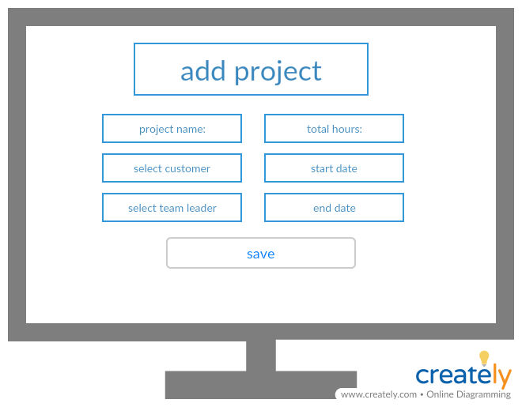
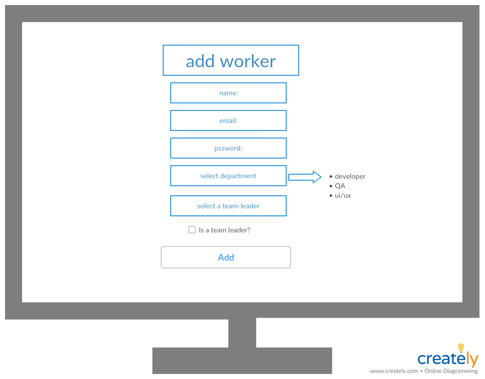
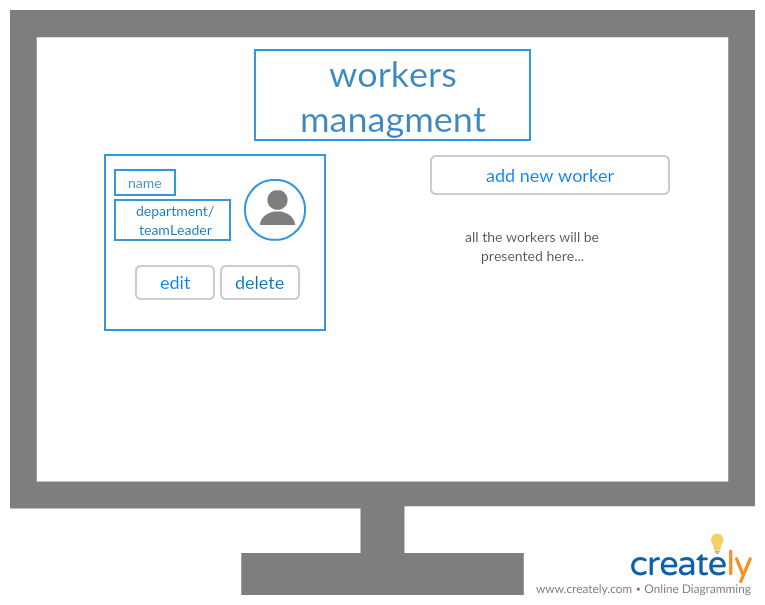

# Cross app - Memory Game

## Using this technologies:
* Web api
* WinForms
* Angular
* MySql

## System diagram:

***
## Web api
### Models
* User:
    * UserId - int, auto increament,primary key
    * UserName - string - minLength: 2, maxLength:15, reqiered
    * Email - string -  reqiered ,pattern
    * Password - string - minLength: 2, maxLength:20, reqiered
    * IsManager - boolean - reqiered
    * DepartmentId - int, required
    * TeamLeaderId - int
    * Navigation  properties:
        * Department - `Department` type
        * TeamLeader - `User` type

* Project:
    * ProjectId - int, auto increament,primary key
    * ProjectName - string - minLength: 2, maxLength:15, reqiered
    * TotalHours - int, required
    * TotalHours - int, required
    * StartDate - dateTime, required
    * endDate - dateTime, required
    * CustomerId - int, required
    * TeamLeaderId - int, required 
    * Navigation  properties:
        * Customer - `Customer` type
        * TeamLeader - `User` type

* DepartmentHours:
    * DepartmentHoursId - int, auto increament,primary key
    * ProjectId - int
    * DepartmentId -int
    * numHours -int
     * Navigation  properties:
        * Project - `Project` type
        * Department - `Department` type

* WorkerHours:
    * WorkerHours - int, auto increament,primary key
    * ProjectId - int
    * WorkerId -int
    * numHours -int
     * Navigation  properties:
        * Project - `Project` type
        * Worker - `User` type

* PresenceHours:
    * PresenceHours - int, auto increament,primary key
    * ProjectId - int
    * WorkerId -int
    * Date- dateTime
    * numHours -int
     * Navigation  properties:
        * Project - `Project` type
        * Worker - `User` type       

* Department:
    * DepartmentId - int, auto increament,primary key
    * DepartmentName - string - minLength: 2, maxLength:15, reqiered 

* Customer:
    * CustomerId - int, auto increament,primary key
    * CustomerName - string - minLength: 2, maxLength:15, reqiered 

### Global Properties
* `List<User>`
* `List<Game>`

### Controllers
* User controller:
    * Post - sign in to a new game    
    requierd data: 
        * userName
        * age
    If the user is valid - we will add him to the UserList, and return true, Else - we will return a matching error
    * Get - get the list of the users that looks for a partner to the game (all the users that contains `null` in the `PartnerUserName` property)
    * Get - get the details of the current user
    * Put - The client sends a userName that he choosed to a partner.
    The server will update his details to the chosen partner. And the `PartnerUserName` property of chosen partner, to his name.   
    If the update completed succefuly - return true, And craete a new `Game` object with the 2 users as players, and the current userName as the `CurrentTurn`  
    Else - return a matching error.
* Game controller:
    * Get - get all cards and `CurrentTurn`
    * Put - The client sends a userName and the chosen cards results.
    The server will update the `Game` object `CurrentTurn` to the other player's name.   
    If the user managed to choose 2 cards with the same value - we will update the element in the `CardArray` that has the key of this card content - to the current user name.
    After the update it will check if the game is over (all the element in the `CardArray` contains value), If yes - the winner usrt will get 1 point to the `score` property.

***
## WinForms +  Angular
  
  
  
  
  
 
 
 