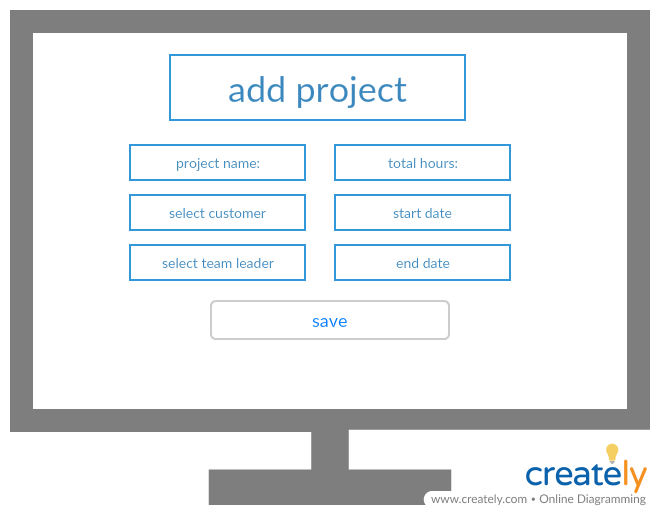
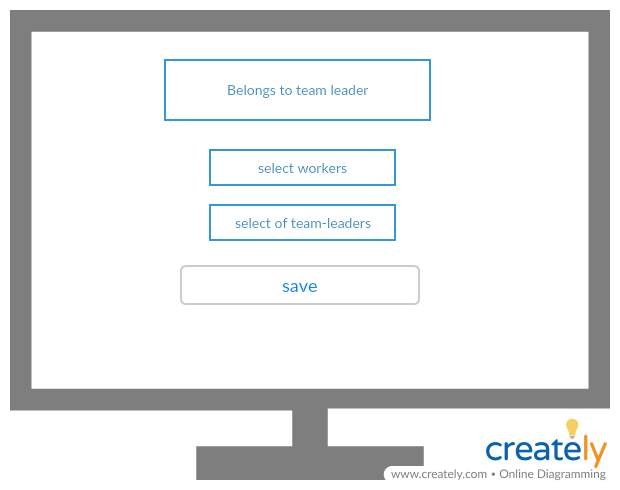
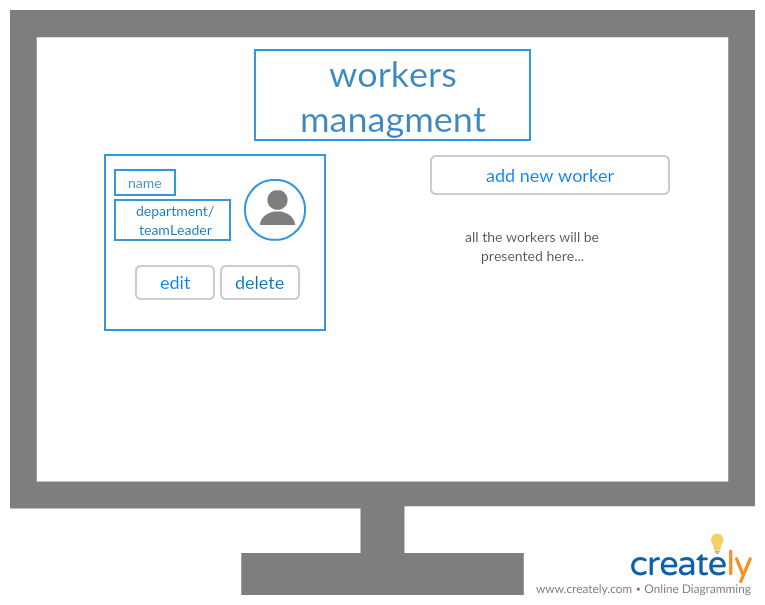
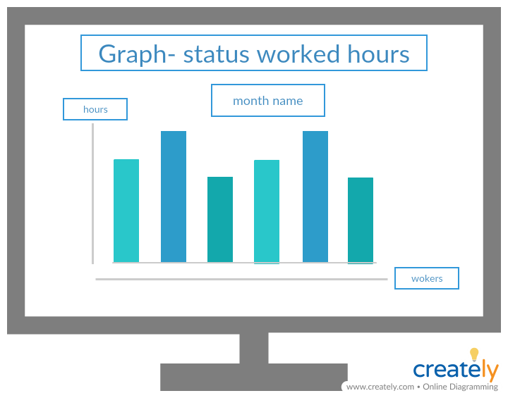
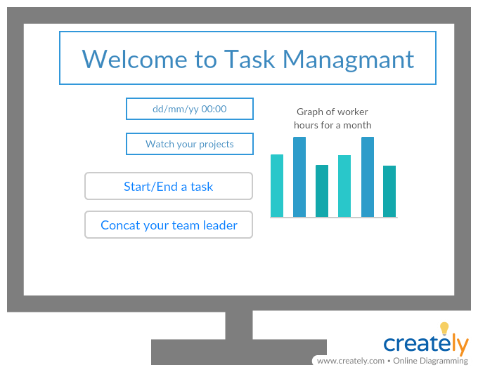

# Cross app - Task Managmant

## Using this technologies:

* MySql
* Web api
* PHP
* WinForm
* Angular

## Authors

* **Efart Zadok** - *a depeloper* - (efrat0879@gmail.com)
* **Tamar Yankelevich- rosenzweig** - *a depeloper* - (tamary9097@gmail.com)

## Description
 
 * [To desciption of the project follow this link](https://github.com/AnnaKarpf/Full-stack-web-development_4578-2/blob/master/12_Web%20api/final%20project.docx)

## Development server

To install the app in your computer you have to:
  1. [Run the `mySql` code](https://github.com/tamarosenzweig/TaskManagmant/blob/master/mysql-queries.md)
      To see some data in the live demo, you should add data to your tabels or
      [Run the data- script code](https://github.com/tamarosenzweig/TaskManagmant/blob/master/mysql-script.md)
      

  2. Run the `back-end` project.(the web api one)  This is the server. Navigate to `http://localhost:4722/`. 
     The app will automatically reload if you change any     of the source files. The details on the server you can see also in the `environments` file  in the angular app, or in the `app config` file   in the cs project (win form) in the `appSetting` attribute.

  3.  Run `ng serve` for a dev server, if you want to run the angular project. Navigate to `http://localhost:4200/`. 
      The app will automatically reload if you change any of the source files. Or just run the `cs` project.

  4.  Run `ng serve` for a dev server, if you want to run the angular project. Navigate to `http://localhost:4200/`. 
      The app will automatically reload if you change any of the source files. Or just run the `cs` project.
      
        *important note: in order to send email from the php server(just if you have xampp) in your computer follow this instruction:* 
        
        in php.ini file find [mail function] and change
        ```sh
        SMTP=smtp.gmail.com
        smtp_port=587
        sendmail_from = my-gmail-id@gmail.com
        sendmail_path = "\"C:\xampp\sendmail\sendmail.exe\" -t"
        
        ```

        Now Open C:\xampp\sendmail\sendmail.ini. Replace all the existing code in sendmail.ini with following code
        ```sh
        [sendmail]

        smtp_server=smtp.gmail.com
        smtp_port=587
        error_logfile=error.log
        debug_logfile=debug.log
        auth_username=my-gmail-id@gmail.com
        auth_password=my-gmail-password
        force_sender=my-gmail-id@gmail.com
        ``` 

        PS: don't forgot to replace my-gmail-id and my-gmail-password in above code.
        Also remember to restart the server using the XAMMP control panel so the changes take effect.
## Tech

Task Managmant uses a number of extension:

*in php platform we use:*

* [xampp](https://www.apachefriends.org/index.html) - Installers and Downloads for Apache Friends!

*in web api platform we use:*
   
* from [Nuget](https://www.nuget.org/packages/Microsoft.CSharp/) we use the Microsoft.AspNet.WebApi.Client

*in angular platform we use:*
    
  * [Angular CLI](https://github.com/angular/angular-cli) version 6.1.5.
        
    * [Angular MATERIAL](https://material.angular.io/) Material Design components for Angular
        
    * [Sweet Alert](https://sweetalert2.github.io/) beatuiul java script pop up   

*in win form platform we use:* 

* [Telerik](https://docs.telerik.com/devtools/winforms/introduction) Performance you demand, UI you can't believe

## System diagram:


***
## Web api

### Models
* User:

    * UserId - int, auto increament,primary key
    * UserName - string - minLength: 2, maxLength:15, reqiered
    * Email - string -  reqiered ,pattern
    * Password - string - minLength: 2, maxLength:20, reqiered
    * IsManager - boolean - reqiered
    * DepartmentId - int, required
    * TeamLeaderId - int
    * Navigation  properties:
        * Department - `Department` type
        * TeamLeader - `User` type

* Project:

    * ProjectId - int, auto increament,primary key
    * ProjectName - string - minLength: 2, maxLength:15, reqiered
    * TotalHours - int, required
    * TotalHours - int, required
    * StartDate - dateTime, required
    * endDate - dateTime, required
    * CustomerId - int, required
    * TeamLeaderId - int, required 
    * Navigation  properties:
        * Customer - `Customer` type
        * TeamLeader - `User` type

* DepartmentHours:

    * DepartmentHoursId - int, auto increament,primary key
    * ProjectId - int
    * DepartmentId -int
    * numHours -int
     * Navigation  properties:
        * Project - `Project` type
        * Department - `Department` type

* WorkerHours:

    * WorkerHours - int, auto increament,primary key
    * ProjectId - int
    * WorkerId -int
    * numHours -int
     * Navigation  properties:
        * Project - `Project` type
        * Worker - `User` type

* PresenceHours:

    * PresenceHours - int, auto increament,primary key
    * ProjectId - int
    * WorkerId -int
    * Date- dateTime
    * numHours -int
     * Navigation  properties:
        * Project - `Project` type
        * Worker - `User` type       

* Department:

    * DepartmentId - int, auto increament,primary key
    * DepartmentName - string - minLength: 2, maxLength:15, reqiered 

* Customer:

    * CustomerId - int, auto increament,primary key
    * CustomerName - string - minLength: 2, maxLength:15, reqiered 


### Help Models

* Email:

    * Subject - string
    * Body - string , reqiered 
    * ToAddress - List<string 
    * UserName - string  
    * Password - string
    the last 3 properties are utomatically restarted in the c'tor.

* Login:

     * Email - string -  reqiered ,pattern
     * Password - string - minLength: 2, maxLength:20, reqiered

### Controllers

* User controller:
    * Login - sign in to the system    
    requierd data: a `Login` object
    If the user is valid - we will check his status and navigate him to the currect main page, else a suitable message will be send to him.

* Manager screens:

   * Users managmant:

     * GetAllUsers- get all the workers in this company.

     * The manager can manage his workers:
         * Add user - add a new user    
              requierd data: a `User` object
              If the user details is valid - we will add the user to the UsersList, and return true, Else - we will return a matching error
         * Edit user- edit worker's details 
           requierd data: a `User` object
           If the update was successful - we will return true, else a suitable message will be send to him.
         * Delete user- the manager can delete worker
           requierd data:`user id` 
           If the delete prompt was successful - we will return true, else a suitable message will be send to him.
         * Edit pemission - allow the worker to work in other projects, not in his team leader's group. 
                             requierd data:`Permission` 
                             If the permission details is valid - we will add the permission to the PermissionsList, and return true, Else - we will return a matching error

  * Projects managmant:

    * Add project - add a new project   
             requierd data: a `Project` object
             If the project details is valid - we will add the project to the ProjectsList, and return true, Else - we will return a matching error

    * GetProjectsReports-  get all the details that the manager needs to the report. The manager can also filter the report assign to his needs
     and to exporet it into an Excel file.

  * Teams managmant:
    * GetAllTeamLeaders- get all the team leaders in this company.

    * Manage the teams: allow editing the team of a specific team leader, remove or add workers to his team.We call to `Edit user` method, to    edit the `team leader id` propert in the `User` members. (see details above.)

* TeamLeader screens:

   * Team managmant:
     * GetAllWorkers- get all the workers in this company,that belongs to this team leader.

     * Update hours- the team leader can update (edit add or delete) the workers' hours details.
        every data saved in a suitable list and when `save` button clicked- the server check the lists in 
        the crud function- add user, edit user or delete hours. see details above.

    * Project managmant: 

        * GetAllProjects- get all the projects in this company,that belongs to this team leader.
        The team leader can see the status of each project. 
        (the function in the reports is `get project reports` that gets all the project's details.)

    * GetPresenceStatusPerWorkers- by this function the team leader can see a graph of his workers.   
       requierd data: `teamLeaderId`
              
   
* Worker screens:

     * Send Email- send email from the worker to his manager.
       requierd data: `Email` objeat and a `User` object
       
    * GetAllProjects- get all the projects in this company,that belongs to this worker.
        The worker can see the status of each project. 
        (the function in the reports is `get project reports` that gets all the project's details.)

    * The worker can see also a graph of his projects by the month.
 

***
## WinForms +  Angular
### login 
### Manager page
  
 
  

### Team leader page
 
 
### Worker page 
  

 